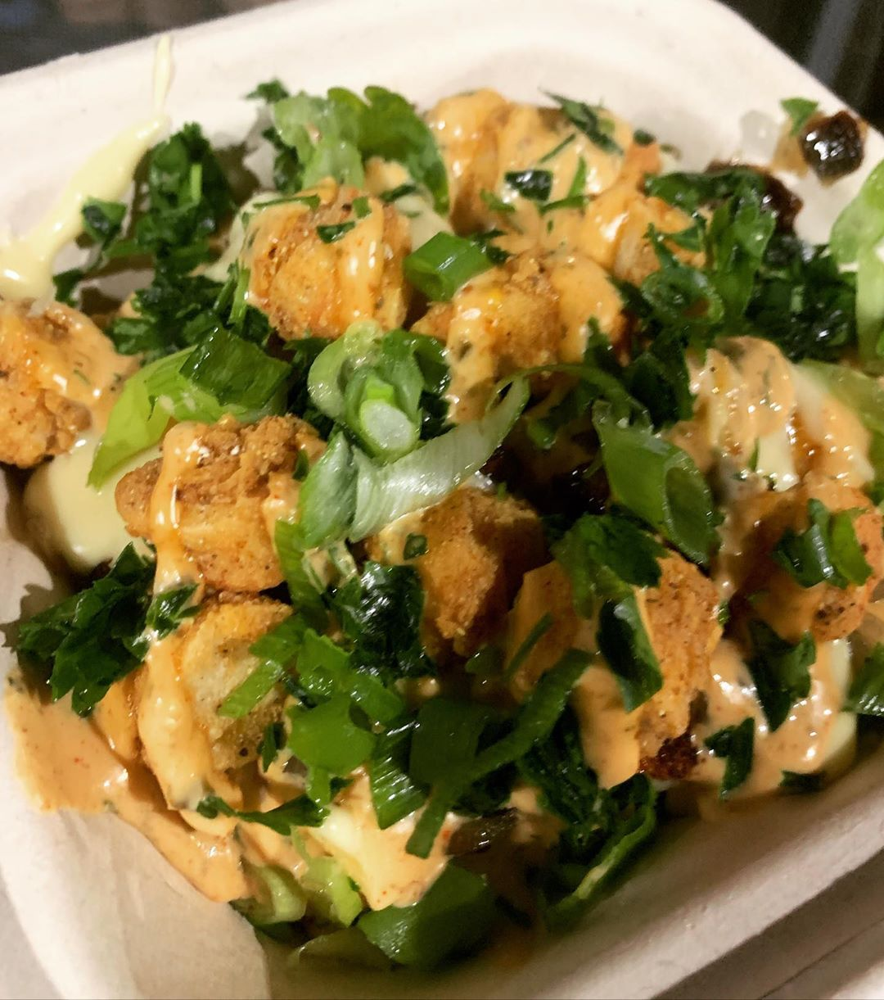

Los Angeles is a vegan hotspot! There are endless amount of vegan restaurants and options, so it can be difficult to decide where to go. Below are our favorite vegan eats in the LA area that we’re sure you’ll love as well. If you end up visiting any of them, tag us on Instagram and let us know what you think!

---

## Voodoo Vegan

One of our top vegan spots hands down! Serving up plant-based creole food, it’s a taste of The South in LA. Everything we’ve ever tasted from here is on point and delicious. The Mac and cheese is the best vegan Mac we’ve ever had and the “shrimp” is next level. Juicy and all that. Getcha some. 

#### Our Favorite Order
Everything on the menu. These ladies be throwin' down wherever they go.

- Mac and Cheese. (Hands Down Best)
- Anything with the shrimp. 
- Anything Else. There are no wrong options. 

This is a pop-up restaurant that serves the LA area, find them on Instagram here [Voodoo Vegan (@voodooveganfood)](https://www.instagram.com/voodooveganfood/)

#### Address

We caught them at Vegan Exchange LA, in North Hollywood on a Sunday.

Vegan Exchange LA  
5300 Bakman Ave  
North Hollywood, CA 91601

Check their [Instagram](https://www.instagram.com/voodooveganfood/) for their updated location.

---

## Monty’s Good Burger 

We Believe the hype. 

Monty’s is known for one thing and one thing only—**BURGERS**. And they are delicious. They use the Impossible Burger 2.0(definitely not something to eat everyday, or at all if you really health conscious) but it truly is the perfect place for when you are craving vegan junk food. We don't eat alot of sugar, but we had to make an exception because the brownies are flame too. We even took my non-vegan dad here and he loved it!

#### Our Favorite Order 
- Double with everything, tater tots with onion ailoi
- Middle of the brownie cookie. 
- Get the dog pile off of the secret menu if you’re feeling frisky. 
  
#### Parking

Pro tip is to park at the Walgreens a few blocks away and walk over. Near Echo Park and Elysian Park so you can eat by some trees. There are also a ton of vintage and thrift shops nearby that you can explore. 

#### Address

Monty's Good Burger  
1533 W Sunset Blvd  
Los Angeles, CA 90026

---

## Donut Friend

We’ve had a lot of vegan donuts and no other donuts have been so fluffy and delicious. They’ve got a million and one donuts to try and they even make custom ones for you. Donut Friend will make you a donut fiend. 

#### Our Favorite Order
- Polar Berry Club (Lemon glazed berry donut)
- Strawberry Lab (for strawberry shortcake lovers)
- Bacon-182

#### Parking 

Street Parking. There are two locations and the one listed below has better parking. 

#### Address

Donut Friend  
5107 York Blvd  
Los Angeles, CA 90042

---

## Shojin

Vegan sushi that will satisfy your craving and leave you feeling amazing. A great place to go for a night out. They go above and beyond and are organic, gluten-free, nut-free, macrobiotic, no refined sugar or table salt, allergy-friendly and they even have soy-free and garlic-free rolls. Service is also amazing here and they have a fancy Japanese toilet in the ladies room. 

#### Our Favorite Order
- Shoj-In-N-Out Hand Roll
- Kiss of the Spider Woman
- Spicy Baked Scallop Roll (garlic free)

#### Parking

Street parking, can be a little tricky but worth it. 

#### Address

Shojin  
12406 Washington Blvd  
Los Angeles, CA 90066

---

## World Empanadas

We are no empanada experts, but these empanadas go hard! Savory, filling and filled with real nutritious veggies—you will be back for more. The crust is crisp and buttery (without the butter) and the fillings are well seasoned.  Definitely stop by for a snack or a full meal if you're in the Burbank area. 

#### Our Favorite Order

Every single savory vegan empanada! We typically split a dozen and get multiples of our favorites. 
- Quinoa & Lentils
- Mushroom & Cashew Cheese
- Pinto Beans & Rice

#### Parking

Street parking, typically always available. Short drive to Griffith Park, so you can make a picnic out of it if you’d like. 

#### Address

World Empanadas  
1206 W Magnolia Blvd  
Burbank, CA 91506
