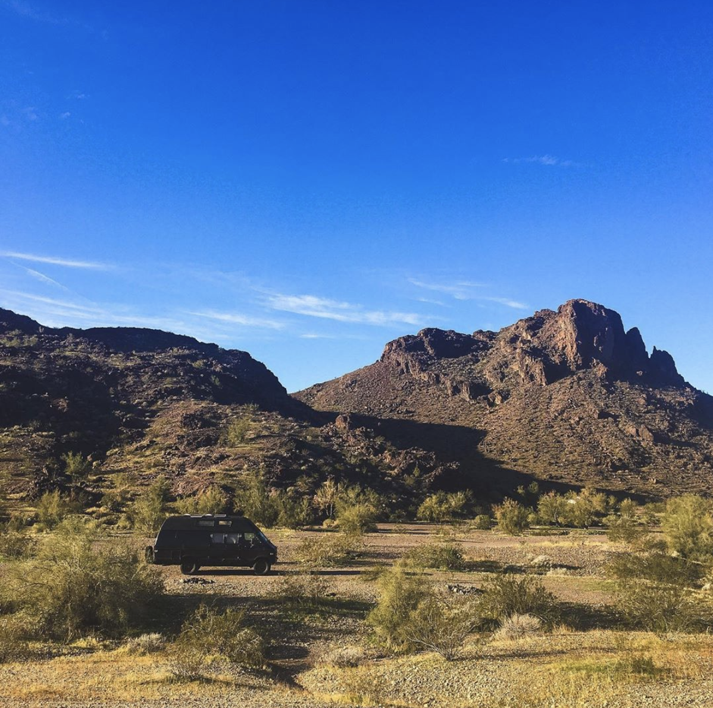
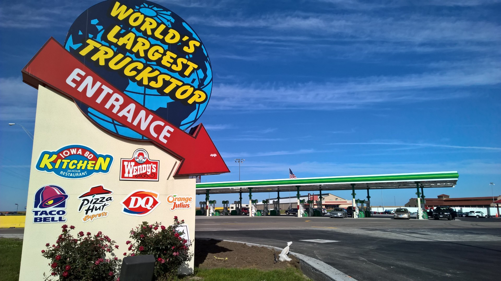

When we first started van life, knowing where to park was a major hurdle for the first few weeks. It was confusing knowing where to park without being disturbed and without disturbing others. This worry was especially high given that we are traveling in a large and noticeable camper van, rather than a more incognito sprinter or cargo van. As we got used to being on the road, parking became easier and easier and now it’s an easy process. Below are our tips  for stress free parking.  All of the spots below are FREE as we don’t see any reason to ever pay for parking. 

Pro Tip: We suggest using the [iOverlander App](http://ioverlander.com/) as a reference point when looking for parking, but you’ll definitely also need to find parking places on your own if you want privacy or if you will be in an area for a while. Google Maps satellite view is also a great way to scope out parking areas and neighborhoods. We have no affiliation with iOverlander, we just love the free app. 

---

## Bureau of Land Management (BLM) & National Forests

This is where most of those #vanlife photos on Instagram are taken. All over the US there is BLM land National Forest where you can park for free right in nature. There are no amenities like toilets or running water so you have to bring everything that you need. If you want to have the best of off grid living and amenities like grocery stores and gas stations, we suggest looking for spots that are within 15 miles from a town. [iOverlander App](http://ioverlander.com/) is our go to for scoping out spots and more often than not there are more spots available as you make your way to any listed on the app.

#### When to Park Here 
If you want to be surrounded by nature, need fresh air, space from other people and living the full off-grid experience. 

---

## Street Parking

Street parking in the right neighborhoods is always a great option for longer term stays. We always park by apartment complexes as we find that people tend to care less about who is coming and going. We’ve found that the best option is to have an apartment complex on one side of you and the other side to be a fence, an open field, or essentially anything that is not someone’s single standing house. Be sure to check for any parking restriction signs to make sure you can park without a worry. 

#### When to Park Here
When you're staying somewhere for a while and can have a few spots in rotation. Make sure that the street lights aren't shining right onto your bed, or else you might have trouble falling asleep.
  
---

## Planet Fitness

The majority of Planet Fitnesses are 24 hours. That means that there are often people working out during all hours of the day. Now, not all Planet Fitness parking lots are good spots to park overnight. We check by making sure that it is a 24 hour Planet Fitness, that it is not in a major shopping center, and that there are no signs saying that overnight parking is not allowed or that the parking lot is private property and cars will be towed. The best part about this parking spot is that you can wake up and go to the gym first thing in the morning! We suggest arriving after dark and we do not suggest staying more than one night in a row at the same Planet Fitness, rotation is key. 

#### When to Park Here
Suburban stop-overs and getting that early morning or late night workout in. 

---

## Truck Stops

For us, truck stops are a last resort parking option. They are typically right off of highways, noisy, polluted and constantly have cars and trucks coming and going. At a minimum, they always have a bathroom and a vending machine and at best they have showers, convenience shops, restaurants, hotels and even shopping malls.  

#### When to Park Here

Overnight sleeping when on a road trip across states with no time for detours.

---

## Walmart

These days more and more Walmarts do not allow overnight parking. For instance, in California there are essentially no Walmarts that allow you to park overnight. However, as you move to less densely populated areas, Walmart parking becomes more and more of an option. We suggest looking for 24 hour Walmarts that are in middle to lower class neighborhoods as we find that they are the best option. You can also always call ahead to a Walmart to ask if they allow overnight parking. Most Walmarts that allow overnight parking are typically listed in the iOverlander app, and you can also check the Allstays website [here](https://www.allstays.com/c/wal-mart-locations.htm). 

#### When to Park Here

When you need somewhere to park in a suburban or rural area, and if you'd like to have 24 hour access to bathrooms and snacks.